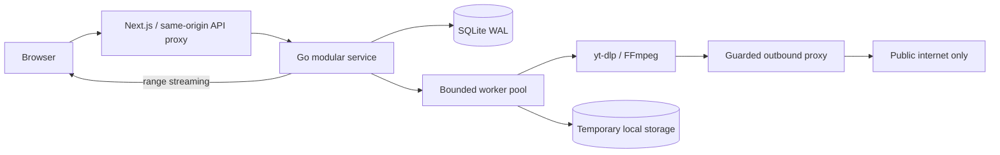

# OpenDownload

**A quieter way to save media.**

Paste a public link. See what is actually available. Choose a format. Save it.

OpenDownload is a self-hosted, open-source media workspace built with Next.js,
TypeScript, Go, yt-dlp, and FFmpeg. It is designed for people downloading content
they own or have permission to save. No ads, tracking, accounts, or credentials.

> Pre-release software. Platform availability changes. A supported extractor is
> not a guarantee that every URL works. Authenticated, private, paywalled,
> live, and DRM-protected content are outside the product boundary.

## Project status

Development follows the [roadmap](docs/ROADMAP.md) and
[granular backlog](docs/BACKLOG.md). Architectural decisions, limitations, and
research are recorded in the repository. See [verification](docs/VERIFICATION.md)
for the checks actually completed; planned checks are not claimed as passing.

## Focus

- Detect the source while you type; analyze only when you ask.
- Select source video qualities or audio conversion, thumbnails, and subtitles.
- Queue processing, inspect progress, cancel, retry, and stream the saved file.
- Keep jobs across restarts. Interruptions become explicit failures you can retry.
- Keep files temporarily with a visible expiry; delete them on request.
- Respect public access boundaries and retain embedded watermarks.
- Support public direct images and extractor-provided image collections; see
  [capabilities](docs/CAPABILITIES.md) for the limits of image extraction.

## Run with Docker

```sh
cp .env.example .env
docker compose up --build
```

Open **http://localhost:3000**. Compose exposes the web app on loopback only.
The API and its outbound proxy run on an internal network. The proxy is the
only container allowed outbound networking. See [self-hosting](docs/SELF_HOSTING.md)
before changing network exposure.

## Local development

Prerequisites: Node.js 22+, pnpm 10+, Go 1.26+, Python 3.12+, yt-dlp, FFmpeg.

```sh
pnpm install --frozen-lockfile
go -C services/api mod download
# Terminal 1: validates and pins DNS for extractor outbound requests
go -C services/api run ./cmd/egress
# Terminal 2
go -C services/api run ./cmd/api
# Terminal 3
pnpm --filter web dev
```

Local execution does not provide container network isolation. Use Compose when
processing untrusted links. No login cookies or arbitrary extractor arguments
are accepted. [Configuration and operations](docs/SELF_HOSTING.md).

## Verify

```sh
go -C services/api test ./...
go -C services/api vet ./...
pnpm --filter web lint
pnpm --filter web typecheck
pnpm --filter web test
pnpm --filter web build
```

Linux CI also runs the Go race detector and deterministic browser integration
tests. Fixture mode must be explicitly enabled and is visibly labeled in the UI.
Fixture results verify application behavior, not third-party extractor uptime.

## Architecture



No Redis, ORM, message broker, cloud SDK, or microservice orchestration is required.
The separate egress process enforces a security boundary; it is not a second
business service. [Architecture](docs/ARCHITECTURE.md) ·
[threat model](docs/THREAT_MODEL.md) · [design system](design-system/opendownload/pages/workspace.md)

## Contribute

Read [CONTRIBUTING](CONTRIBUTING.md), [coding and testing standards](docs/TESTING.md),
[SECURITY](SECURITY.md), and the [code of conduct](CODE_OF_CONDUCT.md).
Small, tested pull requests are welcome. MIT applies to OpenDownload's original
code; bundled dependencies retain their own licenses.
