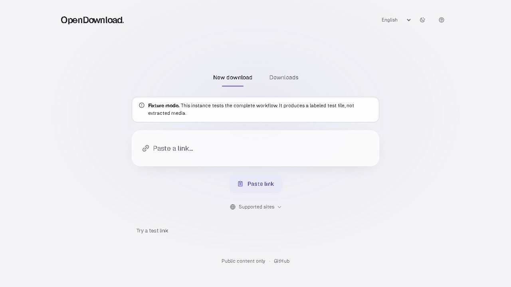
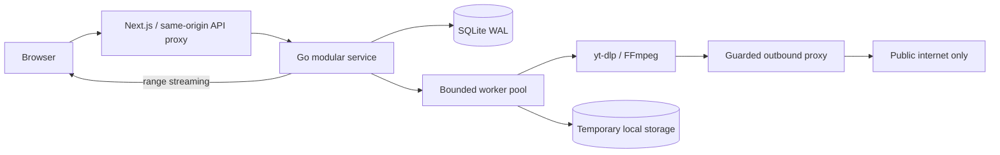

# OpenDownload

**A quieter way to save media.**

[](https://github.com/Lord-shaban/OpenDownload/actions/workflows/ci.yml)
[](LICENSE)
[](https://github.com/Lord-shaban/OpenDownload/releases/tag/v0.1.0)

Paste a public link. See what is actually available. Choose a format. Save it.

OpenDownload is a self-hosted, open-source media workspace built with Next.js,
TypeScript, Go, yt-dlp, and FFmpeg. It is designed for people downloading content
they own or have permission to save. No ads, tracking, accounts, or credentials.

> **v0.1.0 — first release. YouTube is not supported in this version.**
> Platform availability changes. A supported extractor is
> not a guarantee that every URL works. Authenticated, private, paywalled,
> live, and DRM-protected content are outside the product boundary.

## Project status

The first release delivers the minimal glass workspace, English/Arabic and RTL,
real format selection, audio conversion, durable jobs, cancellation/retry,
temporary files, range downloads and guarded outbound networking.

**Live instance:** [opendownload.lord.blitz.cloud](https://opendownload.lord.blitz.cloud/).
The public instance uses real extraction with conservative shared limits and
15-minute file retention. Its free host can sleep between visits.

[Release notes](docs/releases/0.1.0.md) · [Changelog](CHANGELOG.md) ·
[Verified capabilities](docs/CAPABILITIES.md) · [Verification record](docs/VERIFICATION.md).
YouTube and dedicated Instagram/TikTok photo-gallery extraction are deferred.

**Current source additions (2026-10-03):** LinkedIn public video posts,
Pinterest video and original single-image pins, and Threads public posts
(single video/image or up to 20 images). Short links and regional Pinterest
domains are recognized. These additions require a source build; the published
`v0.1.0` images and existing release tag retain their original scope.
See [source support and examples](docs/SOCIAL_SOURCES.md) for exact boundaries.
The [roadmap](docs/ROADMAP.md) separates these from the completed 0.1 scope.
Changes follow the [protected-branch PR workflow](docs/GITHUB_WORKFLOW.md).



[Arabic dark preview](docs/assets/workspace-glass-ar-dark.jpg) ·
[Arabic mobile preview](docs/assets/workspace-glass-ar-mobile.jpg) ·
[Supported sites on mobile (v0.1 fixture preview)](docs/assets/release-0.1-sites-ar-mobile.png)

## Focus

- Paste to analyze immediately, or type a link and press Enter.
- Choose a real format and download in a minimal glass workspace.
- Open a compact supported-sites list when you need it.
- Recognize LinkedIn, Pinterest and Threads alongside the existing sources.
- Select source video qualities or audio conversion, thumbnails, and subtitles.
- Queue processing, inspect progress, cancel, retry, and stream the saved file.
- Keep jobs across restarts. Interruptions become explicit failures you can retry.
- Keep files temporarily with a visible expiry; delete them on request.
- Respect public access boundaries and retain embedded watermarks.
- Switch between English and Arabic, with keyboard access and RTL layout.
- Keep your light/dark theme on reload; respect reduced motion and transparency.
- Support public direct images and extractor-provided image collections; see
  [capabilities](docs/CAPABILITIES.md) for the limits of image extraction.

## Run with Docker

Use the versioned release images:

```sh
git clone --branch v0.1.0 https://github.com/Lord-shaban/OpenDownload.git
cd OpenDownload
cp .env.example .env
docker compose -f compose.yaml -f compose.release.yaml pull
docker compose -f compose.yaml -f compose.release.yaml up --no-build -d --wait
```

Or build from the checked-out source:

```sh
cp .env.example .env
docker compose up --build
```

Open **http://localhost:3000**. Compose exposes the web app on loopback only.
The API and its outbound proxy share an internal network. Extractor traffic can
reach the internet only through that proxy. The web service has a separate ingress
network for its published port. See [self-hosting](docs/SELF_HOSTING.md)
before changing network exposure.

For a cloud runtime that supports nested unprivileged Linux namespaces, see the
[single-container real download profile](docs/FENCED_CLOUD.md). It forces real
extraction, keeps the guarded network boundary, and uses smaller public limits.

## Local development

Prerequisites: Node.js 24, pnpm 11.25.0, Go 1.27.1+, Python 3.12+, yt-dlp, FFmpeg.

```sh
pnpm install --frozen-lockfile
go -C services/api mod download
# Terminal 1: validates and pins DNS for extractor outbound requests
go -C services/api run ./cmd/egress
# Terminal 2
go -C services/api run ./cmd/api
# Terminal 3
pnpm --filter web dev
```

Local execution does not provide container network isolation. Use Compose when
processing untrusted links. No login cookies or arbitrary extractor arguments
are accepted. [Configuration and operations](docs/SELF_HOSTING.md).

## Verify

```sh
go -C services/api test ./...
go -C services/api vet ./...
pnpm --filter web lint
pnpm --filter web typecheck
pnpm --filter web test
pnpm --filter web build
```

Linux CI also runs the Go race detector, dependency audits, deterministic browser
integration tests and Docker network checks. Fixture mode must be explicitly enabled and is visibly labeled in the UI.
Fixture results verify application behavior, not third-party extractor uptime.

## Architecture



No Redis, ORM, message broker, cloud SDK, or microservice orchestration is required.
The separate egress process enforces a security boundary; it is not a second
business service. [Architecture](docs/ARCHITECTURE.md) ·
[threat model](docs/THREAT_MODEL.md) · [design system](design-system/opendownload/pages/workspace.md)

## Contribute

Read [CONTRIBUTING](CONTRIBUTING.md), [coding and testing standards](docs/TESTING.md),
[SECURITY](SECURITY.md), and the [code of conduct](CODE_OF_CONDUCT.md).
Small, tested pull requests are welcome. MIT applies to OpenDownload's original
code; bundled dependencies retain their own licenses.

[Localization guide](docs/LOCALIZATION.md) · [Third-party notices](THIRD_PARTY_NOTICES.md).
