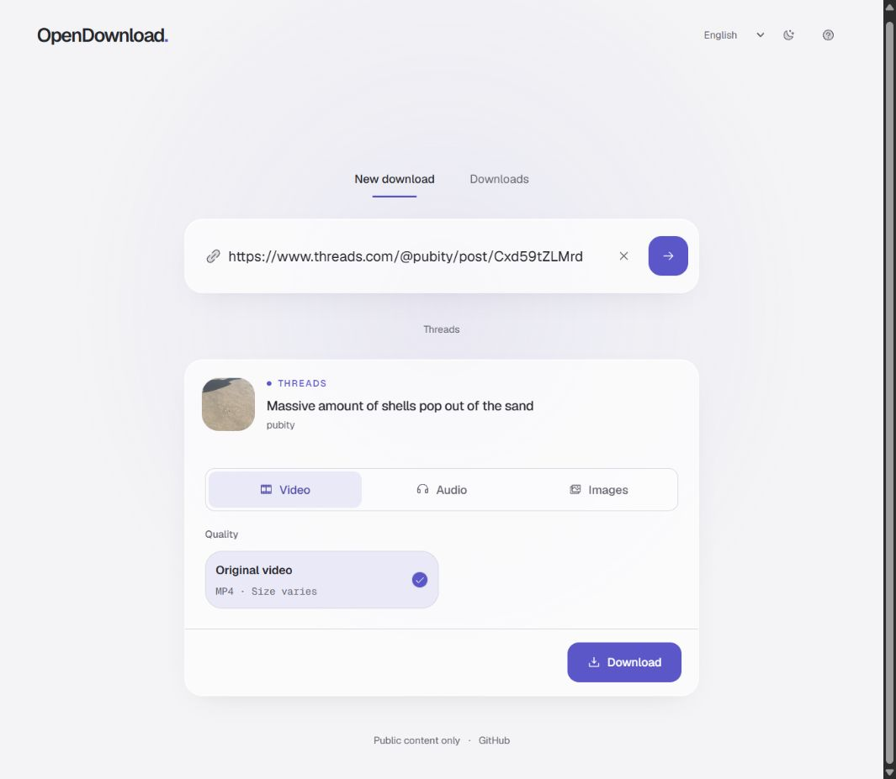
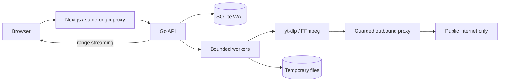
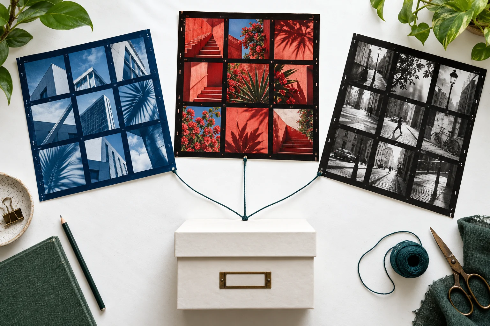

<h1 align="center">OpenDownload.</h1>
<p align="center"><strong>Public media. The actual file. Your own workspace.</strong></p>
<p align="center">An open-source downloader for video, audio and images.<br>English and Arabic. Self-hostable. No account required.</p>

<p align="center">
  <a href="https://github.com/Lord-shaban/OpenDownload/actions/workflows/ci.yml"></a>
  <a href="LICENSE"></a>
  <a href="https://github.com/Lord-shaban/OpenDownload/releases/tag/v0.1.0"></a>
</p>
<p align="center">
  <a href="https://opendownload.lord.blitz.cloud/">Open App</a> &nbsp; / &nbsp;
  <a href="https://opendownload-website.vercel.app/en">Website</a> &nbsp; / &nbsp;
  <a href="docs/SELF_HOSTING.md">Self-Hosting</a> &nbsp; / &nbsp;
  <a href="docs/CAPABILITIES.md">Capabilities</a> &nbsp; / &nbsp;
  <a href="README.ar.md">العربية</a>
</p>

<picture>
  <source media="(prefers-color-scheme: dark)" srcset="docs/assets/workspace-dark-v2.jpg">
  <source media="(prefers-color-scheme: light)" srcset="docs/assets/workspace-video-v2.jpg">
  
</picture>

<p align="center"><sub>Real application capture, October 2026. <a href="docs/assets/workspace-arabic-mobile-v2.jpg">Arabic on mobile</a> / <a href="docs/SCREENSHOTS.md">Capture provenance</a></sub></p>

## Why OpenDownload

Paste a public link, inspect the source's available formats, and save the file.
The workspace keeps progress, cancellation, retry and file expiry together.
Built with **Next.js, TypeScript, Go, yt-dlp and FFmpeg**, with SQLite for durable jobs.

| Video                                          | Audio                                      | Images                                                                      |
| ---------------------------------------------- | ------------------------------------------ | --------------------------------------------------------------------------- |
| Select the formats the source actually offers. | Save available audio or convert to MP3.    | Save direct images, Pinterest originals and image-only Threads collections. |
| No invented quality or resolution options.     | An audio track is required for conversion. | Collections are bounded; supported image collections download as ZIP.       |

| Designed for everyday use                                  | Designed to be operated                                                    |
| ---------------------------------------------------------- | -------------------------------------------------------------------------- |
| English/Arabic, RTL, keyboard access, light/dark themes    | Durable jobs, bounded workers, explicit failures after interruptions       |
| Download progress, cancel, retry, expiry and deletion      | Temporary local files, HTTP range streaming, no Redis or message broker    |
| No ads, tracking, accounts or login credentials in the app | Guarded outbound proxy, public-IP validation and isolated Compose networks |

## Sources And Scope

**Current source adds LinkedIn, Pinterest and Threads.** The public application
uses these adapters; self-hosters must build from `main` to get them. The published
`v0.1.0` container images and release tag retain their original scope.

| Source                                        | Current capability                                                              |
| --------------------------------------------- | ------------------------------------------------------------------------------- |
| LinkedIn                                      | Public video posts and activity links; `lnkd.in` redirects                      |
| Pinterest                                     | Public video pins and original single-image pins; `pin.it` and regional domains |
| Threads                                       | Public single video/image posts and image-only collections up to 20 items       |
| TikTok, Instagram, X, Facebook, Reddit, Vimeo | Public media through available extractors; restrictions vary by link and host   |
| SoundCloud                                    | Public audio tracks                                                             |
| Direct links                                  | Public video, audio and image files                                             |

> **Public content you own or have permission to save only.** YouTube, private,
> authenticated, paywalled, live and DRM-protected content are excluded. No cookies,
> access-control bypass or watermark removal. An adapter is not a guarantee that
> every link works. Instagram/TikTok dedicated photo galleries remain deferred.

[Exact source boundaries](docs/SOCIAL_SOURCES.md) / [Verified capabilities](docs/CAPABILITIES.md) /
[Real download evidence](docs/VERIFICATION.md) / [Roadmap](docs/ROADMAP.md)

The [public app](https://opendownload.lord.blitz.cloud/) uses real extraction,
conservative shared limits and **15-minute file retention**. Its free host can
sleep between visits. Save files to your device before they expire.

## Self-Host

Build from the current source for all current adapters:

```sh
git clone https://github.com/Lord-shaban/OpenDownload.git
cd OpenDownload
cp .env.example .env
docker compose up --build -d --wait
```

Open **http://localhost:3000**. Compose exposes the web app on loopback only.
The API and egress proxy share an internal network; extractor traffic reaches
the internet only through the guarded proxy. The web app has separate ingress.

<details>
<summary><strong>Install the immutable v0.1.0 release instead</strong></summary>

```sh
git clone --branch v0.1.0 https://github.com/Lord-shaban/OpenDownload.git
cd OpenDownload
cp .env.example .env
docker compose -f compose.yaml -f compose.release.yaml pull
docker compose -f compose.yaml -f compose.release.yaml up --no-build -d --wait
```

This release does not include the current LinkedIn/Pinterest/Threads additions.
See the [v0.1.0 release notes](docs/releases/0.1.0.md).

</details>

Read [self-hosting and configuration](docs/SELF_HOSTING.md) before exposing a
public instance. For hosts that support nested unprivileged Linux namespaces,
the [single-container cloud profile](docs/FENCED_CLOUD.md) preserves the network
boundary and uses smaller public limits. Do not disable isolation to make a host fit.

## Architecture



One business service, one explicit outbound security boundary. No cloud SDK,
ORM or microservice orchestration is required.
[Architecture](docs/ARCHITECTURE.md) / [Threat model](docs/THREAT_MODEL.md)

## Development

Node.js **24**, pnpm **11.25.0**, Go **1.27.1+**, Python **3.12+**, yt-dlp and FFmpeg.

```sh
pnpm install --frozen-lockfile
go -C services/api mod download
# Terminal 1: validates and pins extractor outbound destinations
go -C services/api run ./cmd/egress
# Terminal 2
go -C services/api run ./cmd/api
# Terminal 3
pnpm --filter web dev
```

Local execution does not provide container network isolation. Use Compose for
untrusted links. Login cookies and arbitrary extractor arguments are not accepted.

```sh
go -C services/api test ./...
go -C services/api vet ./...
pnpm --filter web lint
pnpm --filter web typecheck
pnpm --filter web test
pnpm --filter web build
```

Linux CI also runs the race detector, dependency audits, deterministic browser
integration tests and Docker network checks. Fixture mode is opt-in and visibly
labeled. Fixture results verify behavior, not third-party extractor uptime.
[Testing guide](docs/TESTING.md) / [Protected-branch workflow](docs/GITHUB_WORKFLOW.md)

## From The Journal

[](https://opendownload-website.vercel.app/en/blog/linkedin-pinterest-threads)

**[LinkedIn, Pinterest and Threads join OpenDownload](https://opendownload-website.vercel.app/en/blog/linkedin-pinterest-threads)**

Original editorial artwork is separate from real product captures.
[Changelog](CHANGELOG.md) / [Project website](https://opendownload-website.vercel.app/en)

## Contribute

Small, tested pull requests are welcome. Start with [CONTRIBUTING](CONTRIBUTING.md),
[coding standards](docs/TESTING.md), the [code of conduct](CODE_OF_CONDUCT.md) and
[localization guide](docs/LOCALIZATION.md). Report vulnerabilities privately using
the process in [SECURITY](SECURITY.md).

**MIT licensed.** Original code is MIT; dependencies, fonts and source media retain
their own licenses. [License](LICENSE) / [Third-party notices](THIRD_PARTY_NOTICES.md) /
[Workspace design](design-system/opendownload/pages/workspace.md)
