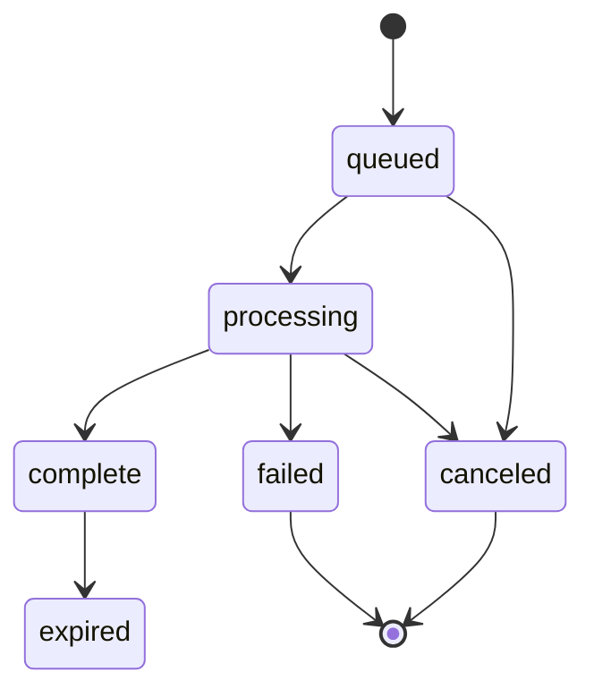

# Architecture

## Boundaries

`apps/web`: Next.js App Router, Tailwind, source-owned shadcn controls. Same-origin
API requests are rewritten to Go. Next.js never runs extractors or buffers files.

`services/api`: Go modular monolith. `net/http` router, SQLite, analysis cache,
worker queue, storage, and media adapters. `cmd/egress` is a small forward proxy
with public-address enforcement used by extractors, not a domain service.

`deploy`: containers and the supported network topology. `docs`: requirements,
ADRs, operations, backlog and test evidence. `scripts`: development and GitHub setup.

`internal/media/social.go` resolves platform short links through the guarded
HTTP client, reads original Pinterest single-image pin metadata and tokenizes
Threads public page JSON with `golang.org/x/net/html`. Threads matches the exact
requested shortcode, excludes private/mixed-video collections, and keeps CDN
URLs internal. Video processing still uses pinned yt-dlp and FFmpeg; workers
reanalyze before processing so signed media URLs are fresh. See
[SOCIAL_SOURCES.md](SOCIAL_SOURCES.md) for the search-preview request header and limits.

## Request flow

1. Session cookie is random and HttpOnly; persisted owners use a SHA-256 hash.
2. Analyze URL with scheme, host, port and public DNS checks. Bounded concurrent
   analysis. Extract safe metadata only; never expose source signed media URLs.
3. Keep owner-scoped analysis in a bounded, expiring memory cache. Return option
   IDs representing explicit format selections. No arbitrary flags from clients.
4. Create a durable queued job, guarded by total capacity and per-owner limits.
5. Workers atomically claim jobs. Re-extract at processing time to avoid expired
   source URLs. Each job has its own deadline, process group and directory.
6. Persist throttled progress. UI polls active jobs and pauses in hidden tabs;
   this avoids an event broker, reconnect protocol, and long proxy connections.
7. Verify output files, limits and paths, then mark complete. Serve with HTTP range
   support under an owner-scoped route and `Content-Disposition: attachment`.
8. A sweeper removes expired records/files and interrupted scratch directories.

## Decisions

| Concern | Choice | Why / scale trigger |
|---|---|---|
| Router | Go net/http ServeMux | Typed boundaries, standard tooling, no framework needed |
| Database | SQLite WAL, modernc driver | Durable single-node state without external infrastructure |
| Queue | SQLite jobs + bounded goroutines | Recoverable queue, explicit interruption recovery; move to leased workers only when multiple nodes needed |
| Storage | Per-job local directories | Range serving, deterministic cleanup; add S3 interface after multi-node demand |
| Cache | Bounded in-memory metadata TTL | Short-lived tokens, no stale public signed links, no Redis needed |
| Status transport | Adaptive short polling | Simple correctness/reconnect; SSE only if measured load warrants it |
| Logging | Go slog JSON | Request IDs and outcome/duration; redact URLs and extractor stderr |
| Observability | Health/readiness + safe counts | No tracing stack without an operational need |
| UI motion | CSS 140–220ms transitions | State continuity and reduced motion without runtime animation dependency |
| Isolation | Non-root containers + guarded egress | Extractors are untrusted parsing processes; public multi-tenancy needs stronger sandboxing |

## Job state machine

Retry creates a new job with the same safe selection (fresh source extraction),
preserving failure history. No automatic retries for access denials. Upstream
transport retries are bounded. Progress percentage may be unknown and may restart
between audio/video streams; postprocessing is a separate indeterminate phase.

No public service promise, arbitrary user yt-dlp options, cookies, user-chosen
filesystem paths, DRM flags, live capture, or FFmpeg remote URL input.
